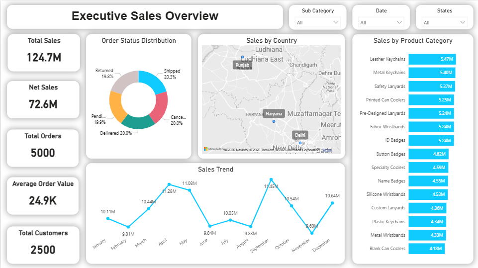
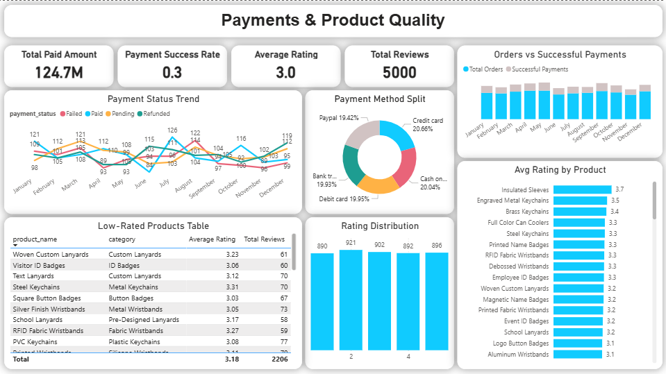

# 📊 Sales & Customer Analytics – Wristband E-Commerce

## 📌 Project Overview
This project presents a **3-page Power BI dashboard** built for a custom wristband e-commerce business (similar to Wrist-Band.com).

The solution covers **end-to-end analytics**:
- Data cleaning & transformation using **Python**
- Star schema data modeling
- Advanced **DAX measures**
- Business-focused visual storytelling in Power BI

---

## 🎯 Business Objectives
- Monitor overall sales and revenue trends
- Identify top-performing wristband categories and products
- Analyze customer demographics and repeat behavior
- Track payment success and failures
- Evaluate product quality using customer reviews

---

## 🗂️ Dataset Description
The dataset consists of **6 tables**:

- **Customers** – customer demographics, age group, country
- **Products** – wristband categories, sub-categories, pricing
- **Orders** – order-level transaction data
- **Order_Items** – product-level sales, quantity, discounts
- **Payments** – payment methods and payment status
- **Reviews** – customer ratings and review dates

---

## 🧱 Data Model
- Star schema design
- One-to-many relationships
- Sales calculated at **order item level** for accurate category & product analysis
- Separate fact tables for payments and reviews

---

## 📊 Dashboard Pages

### 🟦 Page 1: Executive Sales Overview
- KPIs: Total Sales, Net Sales, Orders, AOV, Customers
- Sales trend over time
- Sales by category and country
- Order status distribution

### 🟦 Page 2: Product & Customer Insights
- Top-selling wristband products
- Category & sub-category performance
- Discount vs Net Sales comparison
- Customer age group and regional analysis

### 🟦 Page 3: Payments & Product Quality
- Payment success rate
- Payment method analysis
- Orders vs successful payments
- Product rating distribution
- Identification of low-rated products

---

## 🧮 Key Metrics & DAX
- Total Sales
- Net Sales
- Average Order Value (AOV)
- Repeat Customer %
- Discount Impact
- Payment Success Rate
- Average Product Rating

📄 Full DAX formulas available in **`DAX_Measures.md`**

---

## 🧹 Data Cleaning & Preparation
- Performed using **Python (Pandas & NumPy)**
- Handled missing values and duplicates
- Created customer age groups
- Validated sales and discount calculations
- Exported clean datasets for Power BI

---

## 💡 Key Insights
- Silicone wristbands generate the highest revenue
- Customers aged **18–35** contribute the most sales
- Heavy discounts reduce net margins in some categories
- Card payments show the highest success rate
- Products rated below **3** need quality improvement

---

## 🛠 Tools Used
- Power BI
- DAX
- Python (Pandas, NumPy)
- Data Modeling (Star Schema)

---

## 📌 Outcome
This dashboard enables stakeholders to make **data-driven decisions** related to:
- Pricing strategy
- Marketing targeting
- Payment optimization
- Product quality improvements

## 🖼️ Dashboard Preview

### Executive Sales Overview

### Product & Customer Insights

### Payments & Product Quality

